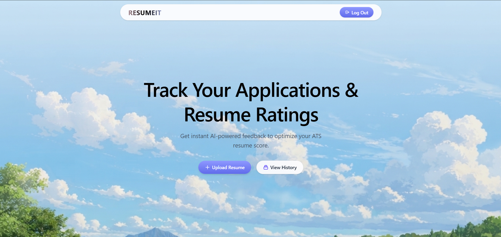

# 📄 AI Resume Analyzer (RESUMEIT)

An intelligent full-stack ATS (Applicant Tracking System) resume analyzer that scores resumes, highlights critical keyword matches, evaluates formatting and tone, and provides actionable, section-by-section improvements powered by **Google Gemini AI**.

---

## 🌟 Preview



<br/>

[](https://nextjs.org/)
[](https://react.dev/)
[](https://nodejs.org/)
[](https://expressjs.com/)
[](https://www.mongodb.com/)
[](https://tailwindcss.com/)
[](https://ai.google.dev/)

---

## ✨ Features

- 🔐 **Secure Authentication**: User registration and login using JWT tokens delivered in secure, HTTP-only cookies with bcrypt password hashing.
- 📤 **Resume Upload with Strict Validation**: Multipart file upload supporting PDF resumes with client-side format checks and server-side magic-byte verification via Multer.
- 🤖 **AI-Powered Deep Analysis**:
  - **Overall ATS Score** (0–100) with visual gauges and benchmarks.
  - **ATS Compatibility Review**: Keyword alignment and formatting scan against specific job titles and descriptions.
  - **Category Breakdown**: Granular scoring and tips across **Tone & Style**, **Content Quality**, **Structure**, and **Key Skills**.
  - **Categorized Tips**: Clear tags (`good` / `improve`) with actionable explanations.
- 📊 **Interactive Review Dashboard**: Detailed breakdown of ATS scores, tips, and direct links to view uploaded PDFs.
- 🗂️ **Application History & Tracking**:
  - Real-time client-side search by company name or job title.
  - Quick-filter pills: **All**, **High (75+)**, **Medium (50–74)**, and **Low (<50)**.
  - Individual resume deletion and bulk **"Wipe Data"** with automated disk cleanup.
- ⚡ **Zero External Client SDKs**: Custom-built, production-grade architecture completely decoupled from third-party client storages.

---

## 🏗️ Architecture & Technology Stack

```
                          ┌── MongoDB (Users, Resumes, Feedback)
                          │
Next.js (Client) ── Axios ── Express (Backend) ───┼── Multer / Local Storage (PDF files)
 (Port 3000)   (HTTP-only │   (Port 5000)         │
                Cookies)  │                       └── Google Gemini API (@google/genai)
                          │
                          └── pdf-parse (Server-side text extraction)
```

### Frontend
- **Framework**: [Next.js 16](https://nextjs.org/) (App Router, Turbopack)
- **UI & Styling**: [React 19](https://react.dev/), [Tailwind CSS v4](https://tailwindcss.com/), [Lucide React](https://lucide.dev/)
- **State Management**: [Zustand](https://github.com/pmndrs/zustand)
- **HTTP Client**: [Axios](https://axios-http.com/) (with `credentials: true`)
- **PDF Rendering**: `pdfjs-dist` (client-side preview rendering)

### Backend
- **Runtime & Framework**: [Node.js](https://nodejs.org/), [Express.js 5](https://expressjs.com/)
- **Database**: [MongoDB](https://www.mongodb.com/) via [Mongoose](https://mongoosejs.com/)
- **AI Integration**: [Google Gemini 2.5 Flash](https://ai.google.dev/) via `@google/genai`
- **File Uploads & Parsing**: [Multer](https://github.com/expressjs/multer) & [pdf-parse](https://www.npmjs.com/package/pdf-parse)
- **Security**: [jsonwebtoken](https://github.com/auth0/node-jsonwebtoken), [bcrypt](https://github.com/kelektiv/node.bcrypt.js), [cookie-parser](https://github.com/expressjs/cookie-parser), [cors](https://github.com/expressjs/cors)

---

## 📁 Project Structure

```
resume-analyser/
├── client/                     # Next.js Frontend
│   ├── app/                    # Next.js App Router
│   │   ├── auth/               # Auth routes (/login, /register)
│   │   ├── resume/[id]/        # Detailed resume feedback page
│   │   ├── resume-history/     # History dashboard with search & filters
│   │   ├── upload/             # Resume submission & analysis flow
│   │   ├── layout.jsx          # Root layout with session hydration
│   │   └── page.jsx            # Landing page
│   ├── components/             # Reusable UI components (Navbar, ATS, Details, etc.)
│   ├── lib/                    # Utilities, Axios instance, Zustand stores
│   └── public/                 # Static assets, icons, screenshots
│
├── server/                     # Express + MongoDB Backend
│   ├── config/                 # Database configuration (Mongoose)
│   ├── controllers/            # Request handlers (auth, resumes)
│   ├── middleware/             # Auth JWT guard, Multer upload handler
│   ├── models/                 # Mongoose schemas (User, Resume)
│   ├── routes/                 # Express API routes (/api/auth, /api/resumes)
│   ├── services/               # Core business logic (aiService, pdfService)
│   ├── uploads/                # Local PDF storage
│   ├── test_phase5.js          # Automated 49-assertion regression test suite
│   └── server.js               # Server entry point
│
├── IMPLEMENTATION_PLAN.md      # Multi-phase migration and architecture tracker
└── README.md                   # Project documentation
```

---

## 🚀 Getting Started

### Prerequisites
- **Node.js** (v18.x or higher)
- **npm** or **yarn**
- **MongoDB** running locally (`mongodb://localhost:27017`) or a MongoDB Atlas connection string
- **Google Gemini API Key** (obtainable from [Google AI Studio](https://aistudio.google.com/))

---

### 1. Backend Setup

1. Navigate to the `server/` directory:
   ```bash
   cd server
   ```

2. Install dependencies:
   ```bash
   npm install
   ```

3. Create a `.env` file in `server/`:
   ```env
   PORT=5000
   MONGODB_URI=mongodb://localhost:27017/resume-analyser
   CLIENT_URL=http://localhost:3000
   JWT_SECRET=your_super_secret_jwt_key
   JWT_EXPIRES_IN=7d
   GEMINI_API_KEY=your_gemini_api_key_here
   ```

4. Start the backend development server:
   ```bash
   npm run dev
   ```
   *The server will start on [http://localhost:5000](http://localhost:5000).*

---

### 2. Frontend Setup

1. Navigate to the `client/` directory:
   ```bash
   cd ../client
   ```

2. Install dependencies:
   ```bash
   npm install
   ```

3. Create a `.env.local` file in `client/`:
   ```env
   NEXT_PUBLIC_API_URL=http://localhost:5000/api
   ```

4. Start the Next.js development server:
   ```bash
   npm run dev
   ```
   *Open [http://localhost:3000](http://localhost:3000) in your browser.*

---

## 📡 API Reference

### Authentication (`/api/auth`)
| Method | Endpoint | Description | Protected |
|---|---|---|---|
| `POST` | `/api/auth/register` | Register a new user | No |
| `POST` | `/api/auth/login` | Log in and receive HTTP-only JWT cookie | No |
| `POST` | `/api/auth/logout` | Clear session cookie | No |
| `GET` | `/api/auth/me` | Fetch currently authenticated user session | Yes |

### Resumes (`/api/resumes`)
| Method | Endpoint | Description | Protected |
|---|---|---|---|
| `POST` | `/api/resumes` | Upload a resume PDF with job metadata (`multipart/form-data`) | Yes |
| `POST` | `/api/resumes/:id/analyze` | Trigger server-side PDF extraction & Gemini AI analysis | Yes |
| `GET` | `/api/resumes` | Retrieve all resumes submitted by the user | Yes |
| `GET` | `/api/resumes/:id` | Fetch single resume document with complete feedback | Yes |
| `DELETE`| `/api/resumes/:id` | Delete a resume and unlink its physical PDF from disk | Yes |
| `DELETE`| `/api/resumes` | Wipe all resumes for the user and unlink their PDFs | Yes |

### System Health
| Method | Endpoint | Description |
|---|---|---|
| `GET` | `/api/health` | Server status and database health check |

---

## 🧪 Testing & Verification

The backend includes a comprehensive test suite covering unit tests, authentication guards, ownership isolation, PDF extraction traversal security, Multer filters, and live Gemini analysis validation.

Run the regression suite from `server/`:
```bash
node test_phase5.js
```
*Expected: `PASSED: 49, FAILED: 0`.*

To run client linting and production build:
```bash
cd client
npm run lint
npm run build
```

---

## 🛡️ Security Highlights

- **HTTP-Only Cookies**: JWT tokens cannot be read by browser JavaScript, protecting against XSS attacks.
- **Path Traversal Protection**: PDF filename sanitization prevents directory traversal attacks during upload and deletion.
- **Magic-Byte PDF Validation**: File headers are inspected to verify valid PDF format, mitigating malicious extension spoofing.
- **Zero Exposed AI Keys**: Google Gemini API keys remain strictly on the backend; all LLM prompts and responses are validated and processed server-side.

---

## 📄 License

This project is licensed under the [ISC License](LICENSE).
