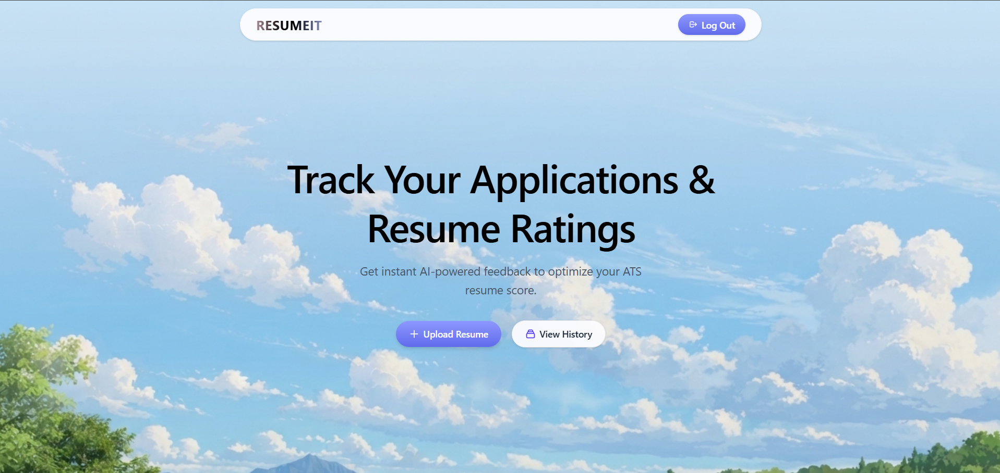
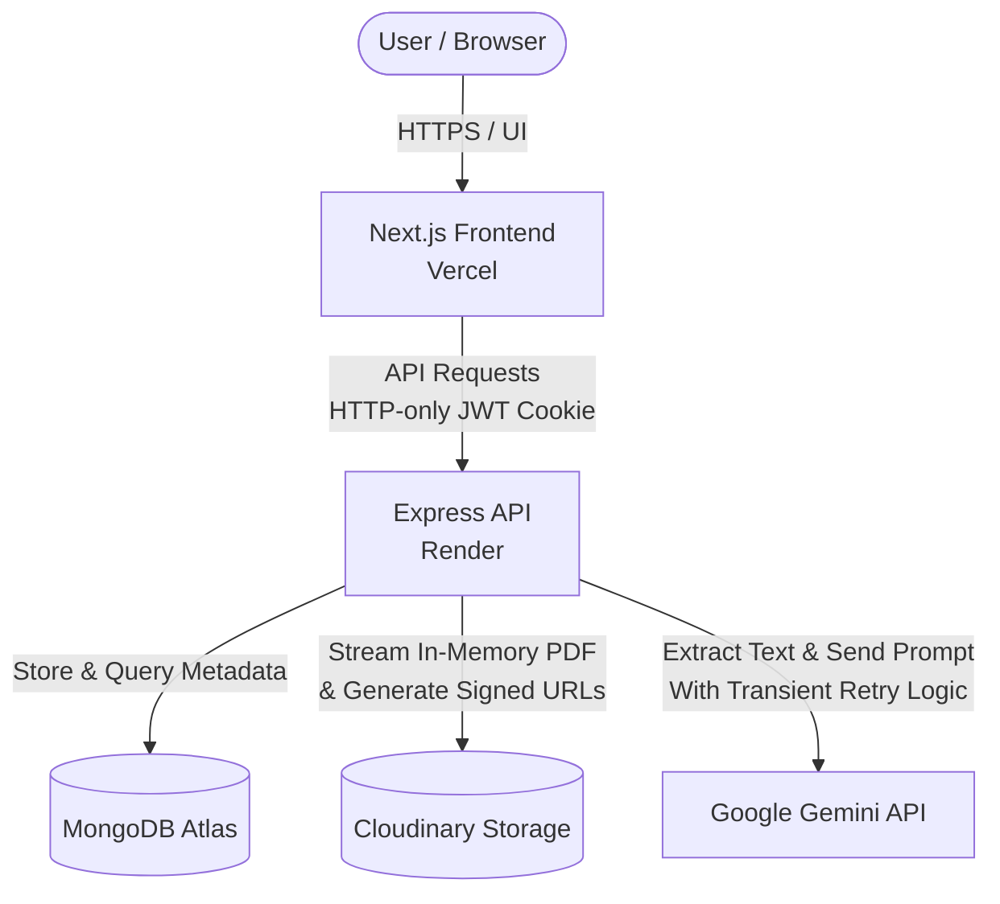

# 📄 Resume Analyser

An intelligent full-stack application that evaluates resumes against targeted job descriptions, calculates ATS compatibility scores, and delivers actionable, section-by-section feedback powered by Google Gemini AI.

[🚀 **Live Demo**](https://resume-analyser-sooty-delta.vercel.app) &nbsp;&bull;&nbsp; [💻 **GitHub Repository**](https://github.com/Anuj-135/Resume-Analyser)

---

## 🌟 Preview



---

## 🛠️ Tech Stack

<div align="center">

[](https://nextjs.org/)
[](https://react.dev/)
[](https://tailwindcss.com/)
[](https://nodejs.org/)
[](https://expressjs.com/)
[](https://www.mongodb.com/)
[](https://mongoosejs.com/)
[](https://cloudinary.com/)
[](https://ai.google.dev/)
[](https://axios-http.com/)
[](https://github.com/pmndrs/zustand)
[](https://vercel.com/)
[](https://render.com/)

</div>

### Technology Breakdown

- **Frontend**: Next.js 16 (App Router), React 19, Tailwind CSS v4, Lucide React, Zustand, Axios (`withCredentials: true`), react-dropzone
- **Backend**: Node.js, Express.js 5, Multer (in-memory storage engine), pdf-parse
- **Database**: MongoDB Atlas via Mongoose 9
- **Authentication**: JSON Web Tokens (`jsonwebtoken`), bcrypt (password hashing), cookie-parser (HTTP-only cookies)
- **File Storage**: Cloudinary (authenticated raw assets, short-lived signed URLs)
- **AI**: Google Gemini API via official `@google/genai` SDK (`gemini-3.8-flash`)
- **Deployment**: Vercel (Frontend), Render (Backend)

---

## 📖 Overview

**Resume Analyser** helps job seekers tailor and optimize their resumes for Applicant Tracking Systems (ATS) and hiring managers. Users submit their resume in PDF format alongside target job details—such as company name, job title, and job description.

The platform extracts resume text server-side, validates the content, and leverages the Google Gemini API to produce detailed, categorized feedback. Resumes are scored across key criteria including ATS suitability, tone and style, content quality, structural organization, and skill relevance, accompanied by granular improvement recommendations and account-level analytics.

---

## ✨ Features

- **User Authentication**: Secure user registration and login powered by JWT tokens stored in HTTP-only cookies, with password hashing via bcrypt.
- **Password Visibility Toggle**: Interactive show/hide toggle for password input fields.
- **Resume Upload & Validation**: Multipart form upload accepting PDF resumes up to 10MB, with client-side type checks and server-side magic-byte (`%PDF-`) verification.
- **In-Memory Streaming**: Uploaded resumes are held in memory buffers and streamed directly to Cloudinary without persisting unauthenticated files to local server disk.
- **AI-Powered Resume Analysis**: In-depth evaluation against target job requirements using Google Gemini with structured JSON output enforcement.
- **ATS Scoring & Category Feedback**: Overall score (0–100) with dedicated ratings and actionable tips categorized as `good` or `improve` across Tone & Style, Content, Structure, and Skills.
- **AI Retry Handling**: Built-in exponential backoff with randomized jitter to seamlessly retry transient Gemini API rate limits (429), capacity spikes (503), internal server errors (500), and network drops.
- **Application History**: Centralized dashboard to view previously submitted resumes with real-time search (by company or title), score filter pills (High, Medium, Low), and individual deletion or bulk wipe.
- **Detailed Review Page**: Section-by-section breakdown of strengths and recommendations, ATS score gauge, and direct access to view the uploaded PDF via signed URLs.
- **Profile Analytics**: Comprehensive analytics dashboard displaying total analyses count, average/highest/lowest scores, score distribution breakdown, category-specific averages, and recent submissions.
- **Secure File Access**: Resumes stored as private/authenticated raw assets in Cloudinary; temporary signed download URLs are generated on demand only after verifying user ownership.

---

## 🏗️ Application Architecture


```mermaid
graph TD
    User([User / Browser]) -->|HTTPS / UI| Frontend[Next.js Frontend\nVercel]
    Frontend -->|API Requests\nHTTP-only JWT Cookie| Backend[Express API\nRender]
    Backend -->|Store & Query Metadata| DB[(MongoDB Atlas)]
    Backend -->|Stream In-Memory PDF\n& Generate Signed URLs| Cloudinary[(Cloudinary Storage)]
    Backend -->|Extract Text & Send Prompt\nWith Transient Retry Logic| Gemini[Google Gemini API]
```

---

## 🔐 Authentication Flow

1. **Registration / Login**: The user provides credentials through the Next.js frontend. Passwords are encrypted server-side using `bcrypt` (10 salt rounds).
2. **JWT Issuance**: Upon successful verification, the server generates a signed JSON Web Token containing the user's ID.
3. **HTTP-Only Cookie**: The JWT is attached to the HTTP response inside a secure, `httpOnly` cookie (`secure: true` and `sameSite: 'none'` in production; `lax` in development). The browser automatically manages cookie storage without exposing tokens to client-side JavaScript.
4. **Authenticated Requests**: Subsequent API calls sent via Axios automatically include the cookie (`withCredentials: true`). The Express `auth` middleware verifies the token and attaches `req.userId` to the request object.
5. **Session Termination**: Logging out clears the authentication cookie on both server and client, resetting client application state.

---

## 📄 Resume Analysis Flow

1. **Submission**: The user enters the target company name, job title, optional job description, and attaches a resume PDF.
2. **Validation & Cloud Storage**: 
   - Multer receives the file into memory buffer.
   - The server validates the PDF magic-byte signature (`%PDF-`).
   - The buffer is streamed to Cloudinary as an authenticated raw asset.
   - A resume document is created in MongoDB referencing the Cloudinary `public_id` and authenticated `userId`.
3. **Text Extraction**: The backend generates a temporary signed Cloudinary URL and extracts text from the PDF using `pdf-parse`.
4. **AI Generation & Retry Handling**:
   - The extracted text and target job parameters are packaged into a structured prompt with a strict JSON schema.
   - The backend invokes the Google Gemini API using `@google/genai`.
   - If transient errors (HTTP 503, 429, 500, or socket timeouts) occur, an exponential backoff algorithm retries the request up to 3 attempts with randomized jitter.
5. **Schema Validation & Persistence**: The returned JSON response is validated against the application's feedback schema and stored in MongoDB under the resume record.
6. **Result Display**: The client redirects to the detailed review page (`/resume/[id]`) to render the score, tips, and category breakdowns.

---

## 📁 Project Structure

```
resume-analyser/
├── client/                          # Next.js frontend
│   ├── app/                         # Next.js App Router
│   │   ├── auth/                    # Authentication routes (/login, /register)
│   │   ├── profile/                 # Profile analytics dashboard
│   │   ├── resume/[id]/             # Detailed resume review page
│   │   ├── resume-history/          # Application history & search
│   │   ├── upload/                  # Resume submission page
│   │   ├── layout.jsx               # Root layout
│   │   └── page.jsx                 # Landing page
│   ├── components/                  # Reusable UI components
│   │   ├── profile/                 # Profile analytics widgets
│   │   ├── ATS.jsx                  # ATS score gauge & suggestions
│   │   ├── Details.jsx              # Category feedback accordions
│   │   ├── FileUploader.jsx         # Drag-and-drop file upload
│   │   ├── Navbar.jsx               # Navigation bar & auth controls
│   │   ├── PasswordInput.jsx        # Password field with visibility toggle
│   │   └── ProtectedRoute.jsx       # Client-side route protection wrapper
│   ├── lib/                         # Axios instance, Zustand stores, utilities
│   └── package.json                 # Client dependencies & scripts
│
├── server/                          # Express backend
│   ├── config/                      # MongoDB connection configuration
│   ├── controllers/                 # Route controllers (auth, resumes, profile)
│   ├── middleware/                  # Auth verification, Multer upload handler
│   ├── models/                      # Mongoose models (User, Resume)
│   ├── routes/                      # API route definitions
│   ├── services/                    # Business logic (aiService, cloudinaryService, etc.)
│   ├── test_phase5.js               # Backend regression integration test suite
│   ├── test_retry.js                # AI transient error retry test suite
│   ├── package.json                 # Backend dependencies & scripts
│   └── server.js                    # Server entry point & health check
│
└── README.md                        # Project documentation
```

---

## 🚀 Getting Started

### Prerequisites
- **Node.js**: v18.x or higher
- **npm**: v9.x or higher
- **MongoDB**: Local MongoDB instance or MongoDB Atlas connection URI
- **Cloudinary Account**: Cloud name, API key, and API secret
- **Google Gemini API Key**: Obtainable from Google AI Studio

---

### 1. Backend Setup

1. Navigate to the `server/` directory:
   ```bash
   cd server
   ```

2. Install dependencies:
   ```bash
   npm install
   ```

3. Create a `.env` file in `server/`:
   ```env
   PORT=5000
   NODE_ENV=development
   MONGODB_URI=mongodb://localhost:27017/resume-analyser
   CLIENT_URL=http://localhost:3000
   JWT_SECRET=your_jwt_secret_key
   JWT_EXPIRES_IN=7d
   GEMINI_API_KEY=your_gemini_api_key
   GEMINI_MODEL=gemini-3.8-flash
   CLOUDINARY_CLOUD_NAME=your_cloudinary_cloud_name
   CLOUDINARY_API_KEY=your_cloudinary_api_key
   CLOUDINARY_API_SECRET=your_cloudinary_api_secret
   ```

4. Start the backend development server:
   ```bash
   npm run dev
   ```
   *The server starts on `http://localhost:5000`.*

---

### 2. Frontend Setup

1. Navigate to the `client/` directory:
   ```bash
   cd ../client
   ```

2. Install dependencies:
   ```bash
   npm install
   ```

3. Create a `.env.local` file in `client/`:
   ```env
   NEXT_PUBLIC_API_URL=http://localhost:5000/api
   ```

4. Start the Next.js development server:
   ```bash
   npm run dev
   ```
   *The application will be accessible at `http://localhost:3000`.*

---

### 3. Running Automated Tests

Run backend integration and retry tests from `server/`:
```bash
cd server
node test_phase5.js
node test_retry.js
```

Run client-side linting and build validation:
```bash
cd client
npm run lint
npm run build
```

---

## ⚙️ Environment Variables

### Backend (`server/.env`)
| Variable | Description |
|---|---|
| `PORT` | Port number the Express API server listens on (default: `5000`). |
| `NODE_ENV` | Application environment (`development` or `production`). Governs cookie security flags. |
| `MONGODB_URI` | MongoDB connection URI (e.g., local MongoDB or MongoDB Atlas connection string). |
| `JWT_SECRET` | Secret key used to sign and verify JSON Web Tokens. |
| `JWT_EXPIRES_IN` | Token validity duration (e.g., `7d`). |
| `CLIENT_URL` | Frontend client URL allowed by CORS (e.g., `http://localhost:3000` or production domain). |
| `GEMINI_API_KEY` | API key for Google Gemini model access. |
| `GEMINI_MODEL` | Gemini model name used for resume analysis (`gemini-3.8-flash`). |
| `CLOUDINARY_CLOUD_NAME` | Cloudinary account cloud identifier. |
| `CLOUDINARY_API_KEY` | Cloudinary API key. |
| `CLOUDINARY_API_SECRET` | Cloudinary API secret. |

### Frontend (`client/.env.local`)
| Variable | Description |
|---|---|
| `NEXT_PUBLIC_API_URL` | Base URL of the backend REST API (e.g., `http://localhost:5000/api` or production URL). |

---

## 🌐 Deployment

The application is architected for decoupled cloud hosting:

- **Frontend**: Hosted on [Vercel](https://vercel.com/) with automatic preview and production deployments.
- **Backend**: Hosted on [Render](https://render.com/) as a Node.js web service running `npm start`.
- **Database**: Managed on [MongoDB Atlas](https://www.mongodb.com/atlas).
- **File Assets**: Managed on [Cloudinary](https://cloudinary.com/) as authenticated raw assets.
- **AI Processing**: Served through Google AI infrastructure via the Gemini API (`gemini-3.8-flash`).

### Health Check Endpoint
The backend exposes a public health endpoint for monitoring service availability and uptime:
```http
GET /api/health
```
Response:
```json
{
  "status": "ok",
  "message": "Server is healthy",
  "timestamp": "2026-09-29T06:36:00.000Z"
}
```

---

## 📡 API Reference

### Health
| Method | Endpoint | Description | Auth Required |
|---|---|---|---|
| `GET` | `/api/health` | Service health status check | No |

### Authentication (`/api/auth`)
| Method | Endpoint | Description | Auth Required |
|---|---|---|---|
| `POST` | `/api/auth/register` | Register a new user account | No |
| `POST` | `/api/auth/login` | Authenticate user credentials and set HTTP-only cookie | No |
| `POST` | `/api/auth/logout` | Clear user session cookie | No |
| `GET` | `/api/auth/me` | Fetch currently authenticated user session details | Yes |

### Resumes (`/api/resumes`)
| Method | Endpoint | Description | Auth Required |
|---|---|---|---|
| `POST` | `/api/resumes` | Upload a PDF resume with target company and job metadata | Yes |
| `POST` | `/api/resumes/:id/analyze` | Trigger PDF text extraction and Gemini AI analysis | Yes |
| `GET` | `/api/resumes` | Retrieve all resumes submitted by the authenticated user | Yes |
| `GET` | `/api/resumes/:id` | Fetch single resume details, feedback, and signed PDF URL | Yes |
| `DELETE` | `/api/resumes/:id` | Delete a single resume and remove its Cloudinary asset | Yes |
| `DELETE` | `/api/resumes` | Delete all resumes and Cloudinary assets for the user | Yes |

### Profile Analytics (`/api/profile`)
| Method | Endpoint | Description | Auth Required |
|---|---|---|---|
| `GET` | `/api/profile/analytics` | Fetch user profile info, aggregated scores, and metrics | Yes |

---

## 🛡️ Security Considerations

- **HTTP-Only Cookies**: Authentication JWTs are transmitted exclusively in `httpOnly` cookies with `secure: true` in production, protecting against cross-site scripting (XSS) token theft.
- **Password Encryption**: Passwords are never stored in plaintext; they are hashed with `bcrypt` using 10 salt rounds.
- **Ownership Verification**: All resume and profile endpoints strictly scope database queries using `req.userId` extracted from the verified JWT.
- **Authenticated Cloudinary Storage**: Uploaded PDFs are stored under Cloudinary's `authenticated` raw asset type. Files cannot be accessed via public URLs; access requires a server-generated signature with an expiration timestamp.
- **In-Memory Uploads**: Multer is configured with `memoryStorage()`, streaming files directly to cloud storage without leaving temporary files on the server's local disk.
- **Magic-Byte Signature Verification**: Uploaded files must match the `%PDF-` binary signature to prevent malicious file extension spoofing.
- **Server-Side API Keys**: Gemini API keys, Cloudinary credentials, and MongoDB connection strings are strictly kept server-side.

---

## 🔮 Future Improvements

- **Exportable Reports**: Generate downloadable PDF and Markdown summaries of AI feedback and ATS recommendations.
- **Multi-Format Support**: Support for Microsoft Word (`.docx`) file uploads in addition to PDF.
- **Version Comparison**: Side-by-side score and tip comparisons across multiple revisions of a resume for the same position.
- **Keyword Gap Highlighting**: Visual comparison matrix highlighting exact missing keywords from job descriptions.

---

## 📄 License

This project is licensed under the [ISC License](server/package.json).
